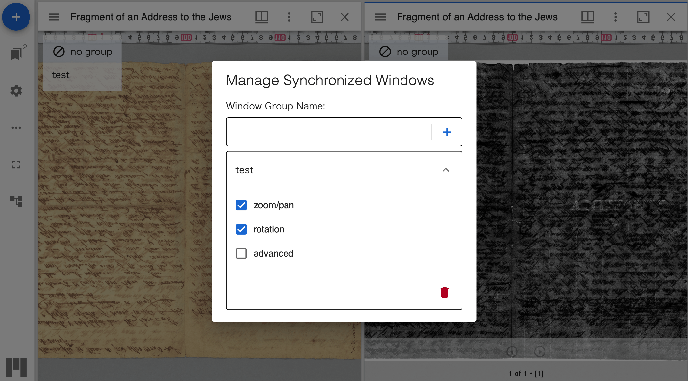
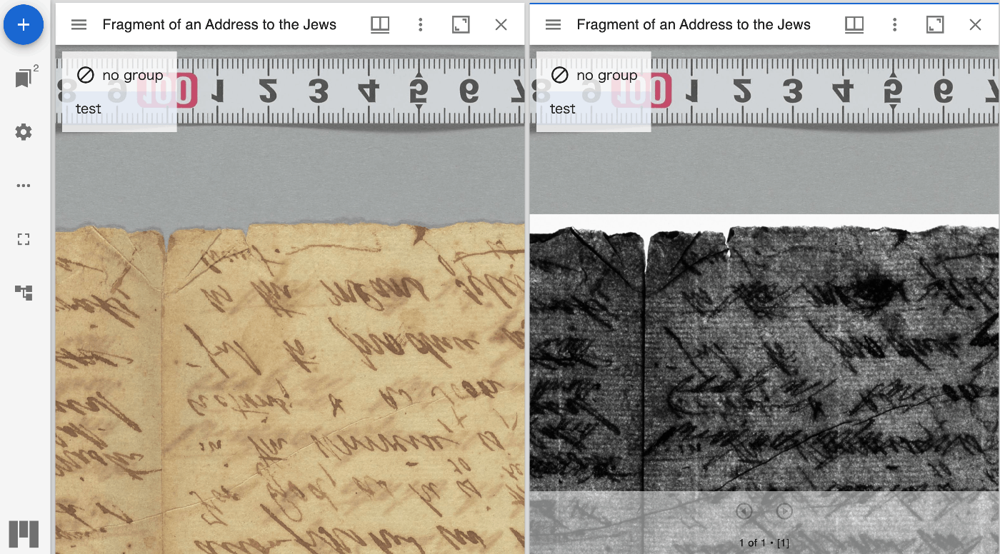

# mirador-sync-windows


<!-- [](https://badge.fury.io/js/mirador-sync-windows) -->

`mirador-sync-windows` is a [Mirador 4](https://github.com/projectmirador/mirador) plugin that adds the ability to synchronize the windows of a Mirador instance. This plugin is useful for comparing multiple images side by side.

This plugin is based on the [mirador-sync-windows](https://github.com/UCLALibrary/mirador-sync-windows) plugin by UCLA Library.





## 🌐 Website

[Visit the demo page](https://nakamura196.github.io/mirador-sync-windows/) to try it out.

## 📖 Configuration

Several configuration options are available on windows that use mirador-sync-windows.

| Configuration        | type    | default | description                        |
| -------------------- | ------- | ------- | ---------------------------------- |
| `syncWindowsEnabled` | boolean | false   | Enabled the image tools by default |

Example configuration:

```javascript
const config = {
  id: "demo",
  windows: [
    {
      syncWindowsEnabled: true,
      manifestId: "https://purl.stanford.edu/sn904cj3429/iiif/manifest",
    },
  ],
};
```

## 📖 Installing `mirador-sync-windows`

`mirador-sync-windows` requires an instance of Mirador 4. See the [Mirador wiki](https://github.com/ProjectMirador/mirador/wiki) for examples of embedding Mirador within an application. See the [live demo's index.js](https://github.com/nakamura196/mirador-sync-windows/blob/master/demo/src/index.js) for an example of importing the `mirador-sync-windows` plugin and configuring the adapter.

## 📣 Contribute

Mirador's development, design, and maintenance is driven by community needs and ongoing feedback and discussion. Join us at our regularly scheduled community calls, on [IIIF slack #mirador](http://bit.ly/iiif-slack), or the [mirador-tech](https://groups.google.com/forum/#!forum/mirador-tech) and [iiif-discuss](https://groups.google.com/forum/#!forum/iiif-discuss) mailing lists. To suggest features, report bugs, and clarify usage, please submit a GitHub issue.
